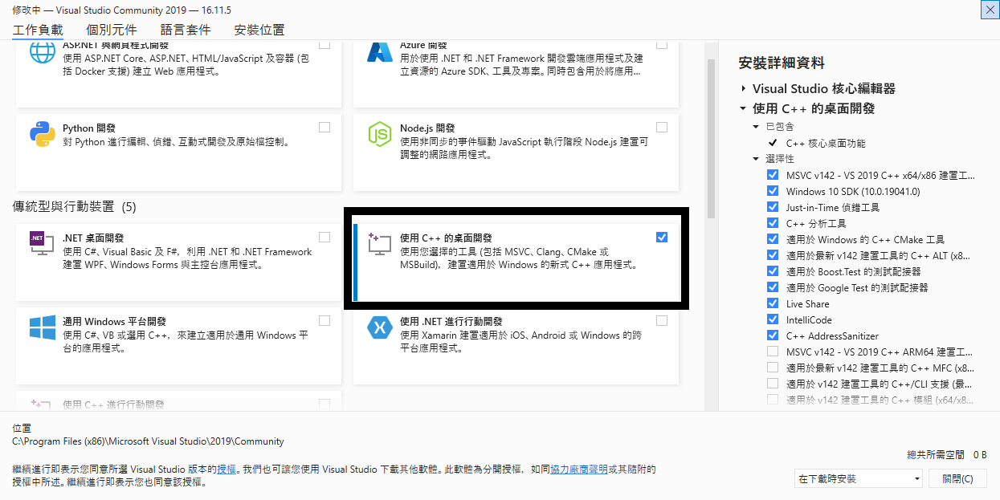
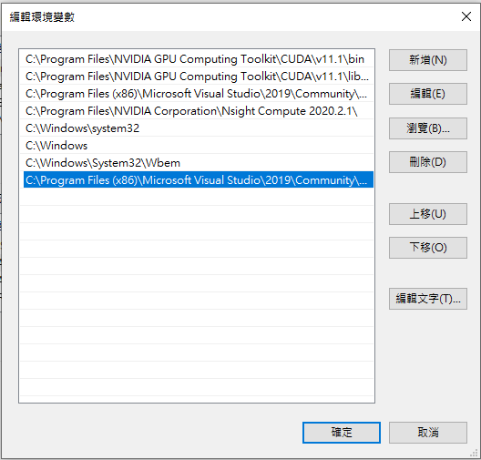
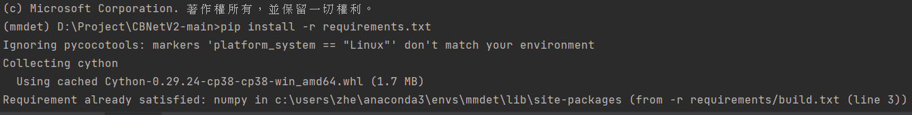

mmdetection安裝過程  
===
 FYI

Prerequisites 
---
https://mmdetection.readthedocs.io/en/latest/get_started.html#installation

   * Linux or macOS (Windows is in experimental support)                      

   * Python 3.6+                                                                

   * PyTorch 1.3+  

   * CUDA 9.2+ (If you build PyTorch from source, CUDA 9.0 is also compatible) 

   * GCC 5+                        

   * MMCV    
   
My Case
---
   * Windows 10

   * Python 3.8.11

   * PyTorch 1.8.0

   * CUDA 11.1.1 
   
   * CUDNN 8.2.1

   * Visual Studio 2019 Community

   * MMCV == 1.3.7 / 1.3.8
  
   * Anaconda
   

Visual Studio 2019 Community
---
https://visualstudio.microsoft.com/zh-hant/vs/community/

 - [x] 使用C++的桌面開發
 - [x] C++ Desktop Development


設定`cl.exe` 的環境變數
Make sure to set the environment variables for MSVC++ `cl.exe`  

系統(關於) -> 進階系統設定 -> 環境變數 -> 系統變數 -> PATH -> 新增

System (Control Panel) -> Advanced system settings -> Environment Variables -> System Variables -> PATH -> add



 
something like  
`C:\Program Files (x86)\Microsoft Visual Studio\2019\Community\VC\Tools\MSVC\14.29.30133\bin\Hostx86\x86`


CUDA
---
CUDA 11.1.1  

https://developer.nvidia.com/cuda-11.1.1-download-archive  

CUDNN 8.2.1

https://developer.nvidia.com/rdp/cudnn-archive

Anaconda Prompt
---

Create enviroment
``` 
conda create -n mmdet python=3.8 -y
```  
Install Pytorch 1.8.0 + CUDA 11.1
``` 
pip install torch==1.8.0+cu111 torchvision==0.9.0+cu111 torchaudio==0.8.0 -f https://download.pytorch.org/whl/torch_stable.html 
```
Install mmcv-full 1.3.7 or 1.3.8
```
pip install mmcv-full==1.3.7 -f https://download.openmmlab.com/mmcv/dist/cu111/torch1.8.0/index.html  
pip install mmcv-full==1.3.8 -f https://download.openmmlab.com/mmcv/dist/cu111/torch1.8.0/index.html
```
Install mmdet
```
pip install mmdet
```
Install requirements in IDE or in(cd) the directory
```
pip install -r requirements.txt
```

  
  
  
  
  
  
  
  
  
  
